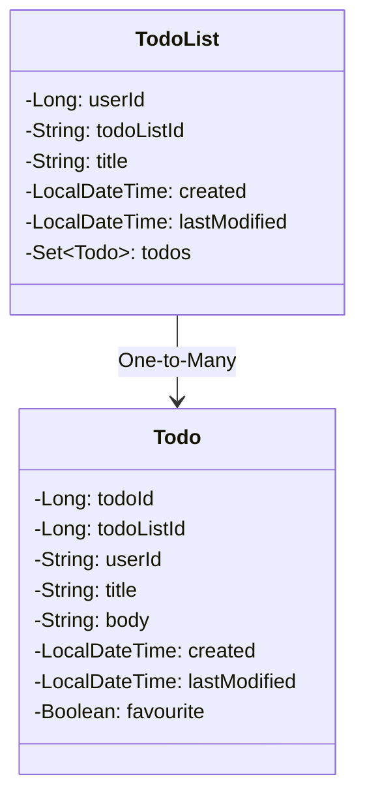
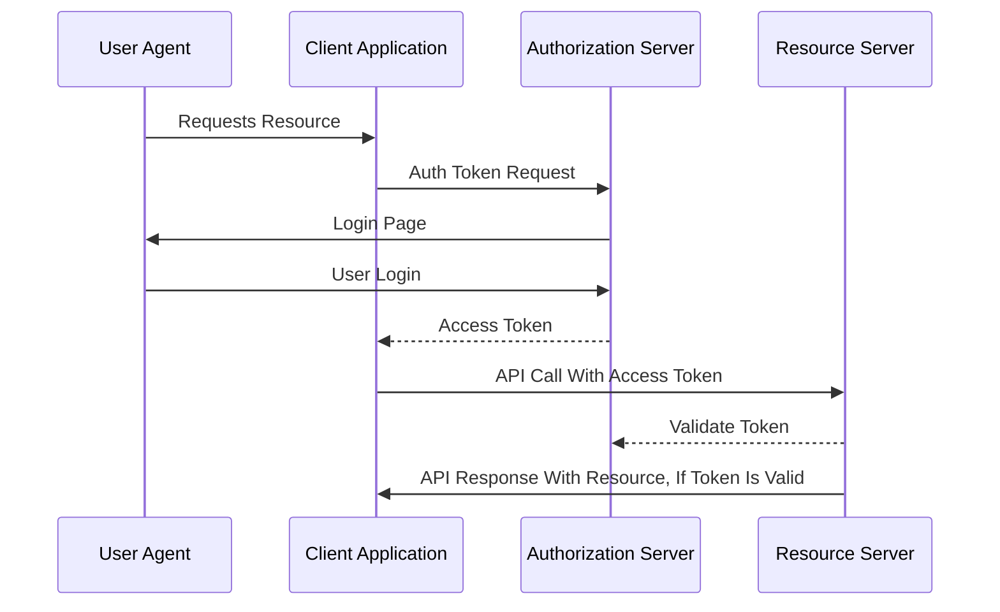

# TODO Full Stack App Backend

## TODOS

1. Add API call cashing with Redis (https://medium.com/simform-engineering/spring-boot-caching-with-redis-1a36f719309f)
2. Elastic + Kibana
3. Integrate gmail SMTP server (Reports on what the user did per week).
4. Send an email every Monday for the the tasks ahead
5. Add Authorization?
6. Add image attachment functionality to the Todo
7. More tests with Spok

## Class Diagram

## Authentication Flow

