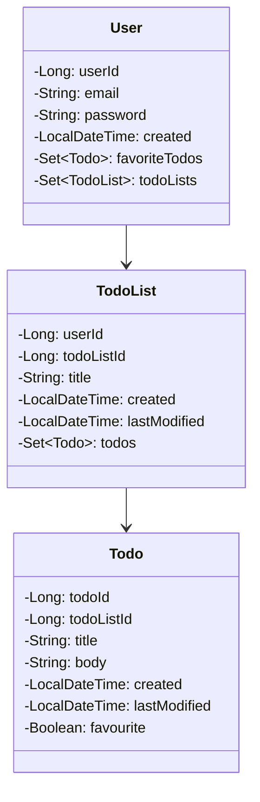
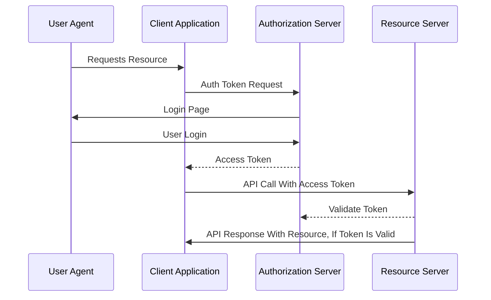

# TODO Full Stack App Backend

## TODOS

1. Add Maven Profiling for integration tests.
2. Complete App Internationalization.
3. Check for potentially problematic behaviour when you call update or delete, and TodoList ID is null.
4. Integrate Log4j.
5. Intgrate gmail SMTP server.
6. Add OAUTH2 Login/registration.

## Class Diagram

## Authentication Flow

