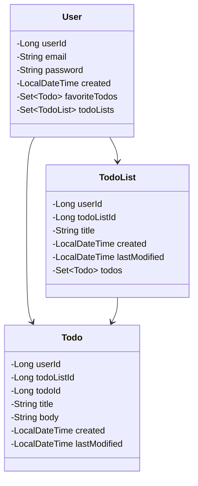

# TODO Full Stack App Backend

## Class Diagram

```mermaid
classDiagram
    class User {
        -Long userId
        -String email
        -String password
        -LocalDateTime created
        -Set~Todo~ favoriteTodos
        -Set~TodoList~ todoLists
    }
    class TodoList {
        -Long userId
        -Long todoListId
        -String title
        -LocalDateTime created
        -LocalDateTime lastModified
        -Set~Todo~ todos
    }
    class Todo {
        -Long userId
        -Long todoListId
        -Long todoId
        -String title
        -String body
        -LocalDateTime created
        -LocalDateTime lastModified
    }
    User --> TodoList
    User --> Todo
    TodoList --> Todo
```

